<!--

  ** DO NOT EDIT THIS FILE
  ** 
  ** This file was automatically generated by the [CLENCLI](https://github.com/awslabs/clencli)
  ** 1) Make all changes directly to YAML files: clencli/<file>.yaml
  ** 2) Run `clencli render template --name=<file>` to render this file
  **
  ** By following this practice we ensure standard and high-quality accross multiple projects.
  ** DO NOT EDIT THIS FILE

-->


 on [Unsplash](https://unsplash.com)](clencli/logo.jpeg)

> Photo by [Markus Spiske](https://unsplash.com/photos/Skf7HxARcoc) on [Unsplash](https://unsplash.com)


[](https://github.com/unixdaddy/do_ansible/issues)

# DigitalOcean Ansible Repo  ( Ansible ) 

Used to test deploying to DigitalOcean with Ansible Engine and Tower

## Table of Contents
---


 - [Usage](#usage) 
 - [Prerequisites](#prerequisites) 
 - [Installing](#installing) 


 - [Acknowledgments](#acknowledgments) 
 - [Contributors](#contributors) 
 - [References](#references) 
 - [License](#license) 
 - [Copyright](#copyright) 


## Screenshots
---
<details open>
  <summary>Expand</summary>


|  |
|:--:| 
| *How to configure* |

|  |
|:--:| 
| *How to run* |

</details>


## Usage
---
<details open>
  <summary>Expand</summary>

**Enviornment Details (Not all are used for this Repo)**

*My local environment consists of*
1. Ansible Engine 2.9 /Tower 2.8.1 Centos Stream 8.3 (VirtualBox - 2vCPU, 5GB Memory and 30GB Disk Space)
2. K8s 1.20 Master RHEL 8.3 (VirtualBox - 2vCPU, 2GB Memory and 30GB Disk Space)
3. K8s 1.20 Worker RHEL 8.3 (VirtualBox - 2vCPU, 2GB Memory and 30GB Disk Space)
4. Ansible Automation Hub 1.2.1 RHEL 8.3 (VirtualBox - 2vCPU, 2GB Memory and 30GB Disk Space)
5. Ansible Automation Hub 1.2.1 Centos Stream 8.3 (VirtualBox - 2vCPU, 2GB Memory and 30GB Disk Space)
6. OpenSuSe Leap 15.2 (WSL)
7. Ubuntu 20.04 LTS (WSL)

*My Cloud environment consists of*
1. DigitalOcean Droplets - varied number, varied sizes of Ubuntu 20.04/20.10 and Centos 8.3

To interact with these environments I am using

- vscode studio code
- mobaxterm
- notepad++
- Github


**End of Enviornment Details (Not all are used for this Repo)**


**This Repo's Purpose**

*The idea of this Repo is for ME to walkthough the process of creating a playbook and then refactoring the playbook tidying up format, using different techniques etc... to learn more. There will be a branch for different phases of refactoring*

**Most of the parameters are set in either the playbook OR role/<role-name>/defaults/main.yml - THIS WILL BE CHANGED AS I GO THROUGH REFACTORING**

*The main branch will be a merge of the last working branch of refactoring*

**THE PRESENT MERGED BRANCH IS TBC**

This repo uses the following from **MY** environment
1. Ansible Engine /  Ansible Tower VM (Local)
2. K8s Master / Worker (Local)
3. DigitalOcean Droplets - Ubuntu 20.04/20.10 and Centos 8.3 (Cloud)

The playbooks aim is to deploy K8s environment - 1 Master and X number of workers locally (pre-provisioned VMs in Virtualbox) and in the cloud to DigitalOcean (provisioning the droplets in the process).

There are 4 playbooks in the repo
- module-role.yml - uses a role to deploy a droplet on Digital Ocean (ansible-engine digitalocean module)
- collection-tower.yml - uses a role to deploy a droplet on Digital Ocean (community.digitalocean collection)
- do-deploy-k8s.yml - uses a role to deploy X number of droplets on Digital Ocean and provision K8s (Centos/Redhat/Ubuntu) (community.digitalocean collection)
- deploy-k8s.yml - uses a role to provision K8s on pre-provisioned VMs (Centos/Redhat/Ubuntu) (community.digitalocean collection)

The focus will be on the last 2 playbooks

**How To Use**

*Set your DigitalOcean Token as an environment variable - export OAUTH_TOKEN=XXXXXXxxxxxxxxxxXXXXXXXXxx*

*Install DigitalOcean Collection - see installing section*


Run do-deploy-k8s playbook which deploys DigitalOcean droplet(s) and then provisions them as a K8s master or as worker nodes
using 2 roles - 1 to provision digitalocean droplet(s) and 1 to provision K8s on the droplet(s)
```
$ ansible-playbook  do-deploy-k8s.yml -i k8s-hosts <---  Builds VMs with these names in the specified groups
```
The main.yml in digitalocean-deploy role will in addition to deploying the droplets add them to the correct groups - master or worker (code snippet below)
```
- name: Add host to group 'master'
  add_host:
    name: '{{ item.data.droplet.name }}'
    ansible_ssh_host: '{{ item.data.ip_address }}'
    groups: master
  when: item.data.droplet.name.find("master") != -1
  loop: "{{ droplet_info.results }}"
- name: Add host to group 'worker'
  add_host:
    name: '{{ item.data.droplet.name }}'
    ansible_ssh_host: '{{ item.data.ip_address }}'
    groups: worker
  when: item.data.droplet.name.find("master") == -1
  loop: "{{ droplet_info.results }}"
```
In the main.yml for provision-k8s role the droplets will be provisioned either as a master or worker depending on what group they have been added to.
Then once the master and worker(s) are configured the worker(s) will be joined to the master (code snippet below).
```
- name: Join K8s workers to Master
  block:

    - name: Join worker to K8s-master
      command: "{{ hostvars[groups['master'][0]]['kube_join_command']['stdout'] }}"

  when: (ansible_hostname != "k8s-master") and (st.stat.exists == false)
```

Run deploy-k8s playbook which provisions the required number of K8s master and worker nodes to **existing** VMs
using 1 role to provision K8s on the VMs. It uses the same role to do this as do-deploy-k8s.yml - provision-k8s.
```
$ ansible-playbook deploy-k8s.yml -i k8s-local <---  Builds VMs with these names in the specified groups
```

**Additional Comments**

- K8s environment is provisioned with CRI-O (not docker)
- K8s environment is provisioned with CILIUM CNI (you can choose something else - CALICO)
- DigitalOcean community collection is used - collections are the future
- ansible.cfg in the project will define collection path - please install collections (see below) before running playbooks

**Ansible Tower**
These playbooks will work in Tower if it has been configured correctly
- project - this repo pulled into Ansible Tower (Tower will automatically pull in DigitalOcean Collection via requirements file)
- credential - New Type for Digital Ocean Token - set as env (injector configuration)
- credential - Machine credential to connect to the new machines - ssh key
- Inventory - inventory configured with groups/hosts - use source from project to use K8s-host or K8-local inventories

  more will be added on this section later
</details>


## Prerequisites
---
<details>
  <summary>Expand</summary>

- [Ansible Engine](https://docs.ansible.com/ansible/latest/installation_guide/intro_installation.html) - Configuration Management and more
- [DigitalOcean Ansible Collection](https://galaxy.ansible.com/community/digitalocean) - DigitalOcean Collection used for Ansible to interact with DigitalOcean Platform
- [Kubernetes Production Environment](https://kubernetes.io/docs/setup/) - Knowledge of Kubernetes for container orchestration
- [Cilium CNI](https://kubernetes.io/docs/setup/) - Knowledge of Cilium CNI - network connectivity between apps and containers

</details>


## Installing
---
<details open>
  <summary>Expand</summary>

for Ansible - use your package manager of choice OR pip
```
$ pip install ansible
```
for DigitalOcean Collection - use requirements file ./collections/requirements.yml and ansible-galaxy command. Note: Tower will do this automatically
```
$ ansible-galaxy collection install -r ./collections/requirements.yml -p ./collections
```
Clone this Repo
```
$ git clone git@github.com:unixdaddy/do_ansible.git
cd do_ansible.git
```
</details>


## Contributors
---
<details open>
  <summary>Expand</summary>

|     Name     |         Email        |       Role      |
|:------------:|:--------------------:|:---------------:|
|  daddy, unix  |  withheld  |  learning  |

</details>


## Acknowledgments
---
<details>
  <summary>Expand</summary>

Gratitude for assistance:
  * All, Who-Came-Before-Me - everything


</details>


## References
---
<details open>
  <summary>Expand</summary>

  * [clencli](https://github.com/awslabs/clencli) - Cloud Engineer CLI


</details>


## License
---
This project is licensed under the Apache License 2.0.


## Copyright
---
```
Company, Inc. or its affiliates. All Rights Reserved.
```

